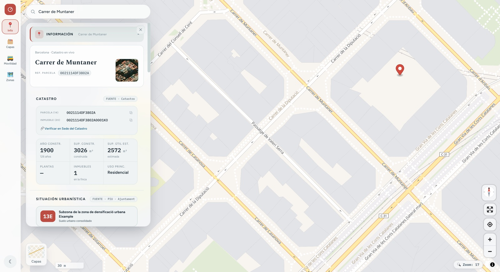
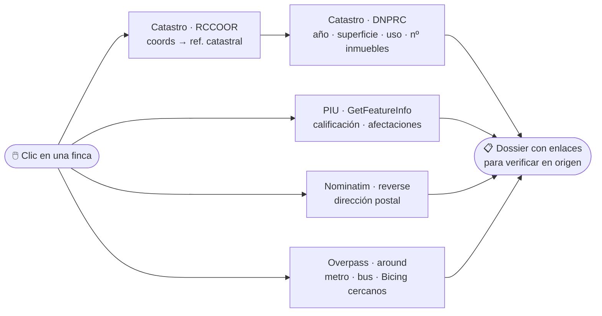

# BCN Radar 🏠📡

[](https://github.com/Jplazadelosreyes/bcn-radar/actions/workflows/deploy.yml)
[](https://github.com/Jplazadelosreyes/bcn-radar/actions/workflows/api-health.yml)
[](https://jplazadelosreyes.github.io/bcn-radar/)


**Haz clic en cualquier finca de Barcelona y descubre lo que nadie te cuenta antes de comprar:**
qué permite el urbanismo, qué dice el Catastro, si hay licencias suspendidas, qué transporte
tienes al lado y qué gastos te esperan. Todo de fuentes oficiales, con enlace para verificarlo.

🌐 **Pruébalo:** https://jplazadelosreyes.github.io/bcn-radar/



> **Cero cifras inventadas.** Si un dato no está en una fuente oficial, no aparece. Cada bloque
> del dossier lleva su procedencia y un enlace para contrastarlo en origen.

---

## Por qué existe

Llegué a Barcelona sin conocer la ciudad y quería comprar mi propia casa. Cada visita a una
vivienda terminaba igual: una noche entera cruzando portales — la situación urbanística en un
visor, el Catastro en otro, la cédula de habitabilidad en un tercero, y el metro más cercano en
Google Maps. La misma búsqueda, piso tras piso.

Así que unifiqué toda esa información pública —urbanismo, Catastro, transporte, open data— en un
solo mapa que consulta las APIs oficiales en directo. Un clic sobre la finca y tengo la
referencia catastral, la situación urbanística (¿hay planes de expropiación?), la locomoción
alrededor y los enlaces directos para comprobar en cada portal que lo que me contaban era real.

**Pude comprar mi casa después de todo.** Esta app fue mi copiloto en cada visita — desde el
móvil, porque los pisos se visitan a pie.

## El problema

Comprar un piso en Barcelona exige cruzar media docena de portales públicos: el Catastro por un
lado, el Portal de Información Urbanística por otro, el registro de zonas tensionadas en un
tercero. Cada uno con su jerga, sus siglas y su visor propio. La información **es pública, pero
no es accesible**: está repartida y escrita para técnicos.

BCN Radar la reúne en un gesto —un clic sobre el mapa— y la traduce. El listón que me puse:
que **mi madre** pueda entender qué significa que su finca tenga la clave `16/18`.

## Qué te dice de una finca

| Bloque | Qué responde | Fuente |
| --- | --- | --- |
| **Catastro** | Año, superficie construida y útil, uso, nº de inmuebles, referencia catastral | Dirección General del Catastro |
| **Situación urbanística** | Calificación, clasificación del suelo, plan, sector y **afectaciones** (licencias suspendidas, planeamiento en trámite) | PIU · Ajuntament (WMS `GetFeatureInfo`) |
| **Lectura crítica** | Traducción a lenguaje llano: qué implica de verdad para ti | Derivado, con su razonamiento a la vista |
| **Valor y gastos** | Referencias de valor y gastos ordinarios estimados | Incasòl · ATC |
| **Checklist del comprador** | Qué comprobar antes de firmar | — |

Y alrededor: **movilidad** (recorridos reales de metro, bus, Rodalies y FGC desde OSM; paradas
GTFS oficiales; Bicing en vivo), **zonas administrativas** con renta media, **capas urbanísticas**
del Ajuntament y la Generalitat, y mapa en **2D o 3D** (relieve real por DEM + edificios extruidos).

### Anatomía de un clic



Todo en paralelo, todo desde el navegador. Ningún dato pasa por un servidor propio.

## Fuentes de datos — y su vigilancia

La app consume **29 integraciones repartidas en más de una docena de servicios públicos**, todas
oficiales, abiertas y sin API key:

| Fuente | Qué aporta |
| --- | --- |
| **Dirección General del Catastro** (OVC) | Referencia catastral por coordenadas, datos físicos de la finca, parcelario WMS |
| **PIU · Ajuntament de Barcelona** (WMS) | Calificación urbanística, planeamiento, suspensiones de licencias, patrimonio |
| **MUC · Generalitat** (WMS) | Planeamiento unificado de toda Cataluña |
| **ACA** (WMS) | Zonas inundables T10 / T100 / T500 |
| **Open Data Generalitat** (Socrata) | Alquiler real por fianzas de Incasòl · temperatura en vivo (Meteocat XEMA) |
| **Bicing** (GBFS) | Bicis y anclajes libres, refresco cada 60 s |
| **OpenStreetMap** | Nominatim (buscador y direcciones) · Overpass ×3 mirrors (recorridos y paradas) |
| **bcn-geodata** (CartoBCN) | Distritos, barrios, secciones censales, término municipal |
| **Basemaps** | OpenFreeMap Liberty (vectorial) · ortofoto ICGC · satélite ArcGIS · OpenTopoMap · DEM Terrarium |

Depender de tantos servicios ajenos sin backend propio significa que cualquiera puede cambiar de URL,
de contrato o morir en silencio. Por eso hay un **chequeo de salud automatizado**:

```bash
npm run test:apis   # 29 peticiones reales mínimas → docs/API_STATUS.md
```

Cada comprobación reproduce el contrato exacto que usa `src/services/` (misma URL, misma forma de
respuesta) contra un punto real del Eixample, y el resultado queda documentado con fecha, latencia
y diagnóstico en [`docs/API_STATUS.md`](docs/API_STATUS.md). Un workflow programado
([`api-health.yml`](.github/workflows/api-health.yml)) lo repite cada lunes y avisa si una fuente
dejó de estar vigente — **sin bloquear jamás el deploy**: la infraestructura pública se satura, y
eso no puede parar la app.

La suite se estrenó encontrando algo: el mirror `overpass.kumi.systems` estaba caído — exactamente
el escenario para el que se diseñó la petición *hedged* de abajo.

## Decisiones de ingeniería

Lo interesante de este proyecto no es el stack, es lo que costó cada decisión.

### Sin backend, y eso es una restricción de diseño

Todo corre en el cliente contra servicios públicos (WMS, WMTS, GBFS, Overpass, Catastro, Open
Data). No hay servidor que mantener ni clave que filtrar, pero el precio es real: **dependes de
infraestructura pública que se satura**. Eso obliga a diseñar para el fallo, no a asumirlo.

El caso concreto: los mirrors de Overpass. El código original los probaba en serie y sin timeout,
y `fetch` no trae uno por defecto. Cuando un mirror aceptaba la conexión pero no respondía —medido:
más de 90 s— la capa no cargaba **nunca**. La solución fue una petición *hedged*:

```js
// Cada intento con su techo; los mirrors salen escalonados. Si el primero contesta
// rápido —lo normal— los demás ni se lanzan. Gana el que llegue antes; el resto se cancela.
return await Promise.any(OVERPASS_ENDPOINTS.map((url, i) => intento(url, i * HEDGE_MS)))
```

Un mirror caído pasa de costar la carga entera a costar 7 s. Ver
[`services/overpass.js`](src/services/overpass.js).

### Romper el monolito, y que no vuelva

`App.vue` llegó a tener **2.694 líneas**. Hoy tiene **84** y es composición pura. El archivo más
grande del proyecto son **179 líneas**. Pero un refactor sin red se deshace solo, así que la regla
está en el CI:

```js
'max-lines': ['error', { max: 300, skipBlankLines: true, skipComments: true }]
```

No es documentación pidiendo buena conducta: es un error de build. Ningún archivo puede volver a
crecer como el viejo `App.vue` sin que el CI lo pare. (La regla ya demostró que no hace
excepciones: atrapó a la propia suite de salud de APIs nada más nacer, y hubo que dividirla en
catálogo + runner.)

### Composables singleton en vez de Pinia

El estado vive en composables de módulo (`useFinca`, `useMapStore`, `useTransporteModos`…). No es
por evitar una dependencia: es que el estado de esta app **es** un puñado de refs compartidos y
funciones que los tocan. Pinia añadiría una capa de ceremonia sin resolver nada que no resuelva un
`ref` en el ámbito del módulo.

Donde dos dominios comparten estado sin que ninguno deba ser dueño del otro, ese estado se extrae
a su propio módulo —[`transporteState.ts`](src/composables/transporteState.ts),
[`searchState.ts`](src/composables/searchState.ts)—. No es estética: sin eso, los imports serían
circulares.

### `any` acotado a una sola frontera

MapLibre tiene tipos enormes y cambiantes. En vez de pelearlos por todo el árbol, el handle del
mapa se tipa `any` **en un único sitio** ([`useMapStore`](src/composables/useMapStore.ts)) y el
resto de la app consume tipos limpios. Los `any` restantes están justificados archivo por archivo
y solo en las fronteras imperativas: MapLibre, XML del Catastro, GeoJSON de Overpass.

### Un camino por acción

Buscar una dirección y hacer clic en el mapa llevaban al mismo sitio con resultados distintos:
buscar volaba y ponía un pin, pero no cargaba el dossier; había que clicar otra vez encima.
Ahora `useSearch` solo traduce texto a coordenadas y delega en el mismo `selectFincaAt` que usa
el clic. Buscar una dirección **es** seleccionarla.

### Sistema visual propio

Los tokens de [`tokens.css`](src/styles/tokens.css) definen un lenguaje —"Mediterrani": roig BCN,
azul mediterráneo, serifa Spectral— con tema día/noche. El detalle del que estoy contento: el
vidrio esmerilado usa **dos capas de canto** porque hacen cosas distintas —`--edge`, un contorno
de tinta que recorta el panel contra un mapa que puede ser claro u oscuro, y `--edge-hi`, el
brillo de la luz sobre el canto—. Con un solo borde blanco, los paneles se disolvían en modo día.

El tema nocturno del mapa no es un CSS invertido: [`map-theme.js`](src/services/map-theme.js)
retiñe las ~110 capas del estilo vectorial con una paleta propia construida sobre los roles de
color de Material Design 3 —fondo teal profundo hermano del chrome, jerarquía por matiz en vez de
brillo, la autopista en el dorado de la casa, y el halo de cada letra del color del propio fondo
para que el texto flote sin cerco negro.

La interacción es deliberadamente la de Google Maps: es el modelo mental que todo el mundo ya
tiene. El diferencial está en el contenido, no en reinventar cómo se arrastra un panel.

## Arquitectura

```
src/
  components/       29 SFC · una responsabilidad cada uno
    map/            MapCanvas (motor) · MapRail · SearchBox · MapLayersBar · StopExplorer…
    sidebar/        InfoDossier (switch por nivel de zoom) → ficha/ → ficha/finca/ (7 bloques)
  composables/      19 stores singleton (todos .ts)
  config/           catálogo curable a mano: capas WMS, capas de datos, modos de transporte
  services/         15 módulos, uno por fuente: catastro · piu · transit · renta · overpass…
  styles/           tokens (design system) → components → responsive
tests/
  api/              salud de las APIs públicas: catálogo de checks + runner → docs/API_STATUS.md
```

Tres reglas que se sostienen solas:

1. **La UI no habla con el mapa.** El handle de MapLibre, el contexto de zoom y las herramientas
   viven en composables; los componentes los consumen sin props ni prop-drilling.
2. **Un fichero, una responsabilidad.** `InfoDossier` es un `<component :is>` que elige ficha por
   nivel de zoom; `FichaFinca` orquesta 7 bloques que se buscan la vida solos.
3. **El catálogo es dato, no código.** Las capas, los modos de transporte y los chequeos de API
   se curan editando datos (`config/`, `tests/api/checks.ts`), sin tocar la lógica.

## Calidad

| Comando | Qué hace |
| --- | --- |
| `npm run dev` | Desarrollo (`:5190`) |
| `npm run build` | Build de producción |
| `npm run typecheck` | `vue-tsc` — TypeScript en todo el árbol |
| `npm run lint` | ESLint (Vue 3 + TS) · incluye la regla anti-monolito |
| `npm run test` | Vitest — 19 tests de lógica pura (rápidos, sin red) |
| `npm run test:apis` | Salud de las 29 APIs públicas → [`docs/API_STATUS.md`](docs/API_STATUS.md) |
| `npm run format` | Prettier |

**CI** (GitHub Actions), dos carriles separados a propósito:

- [`deploy.yml`](.github/workflows/deploy.yml) — cada push a `main` corre `lint + typecheck +
  test`; **solo si pasan** se construye y despliega a GitHub Pages. La rama principal siempre
  está desplegable.
- [`api-health.yml`](.github/workflows/api-health.yml) — cada lunes (y a demanda) verifica que
  las fuentes públicas sigan vigentes. Avisa, pero no bloquea: la salud de un servicio ajeno no
  es un bug de esta app.

Los tests unitarios cubren lo que de verdad puede romperse en silencio: los veredictos de
`useFinca` (ITE, uso, coeficiente), el parseo de `map-theme`, los chips de línea y la curación de
`transporteState`. No hay tests de render por elección — el valor está en la lógica derivada, y
el render se verifica en navegador real.

## Móvil

Mobile-first de verdad, no un `@media` al final — la app nació para acompañar visitas de pisos a
pie de calle. La lógica se escribe una vez, agnóstica de dispositivo; solo cambian layout y
gestos. El rail lateral se convierte en barra inferior, los paneles suben como *bottom sheets*
con arrastre real de tres estados (compacto ⇄ expandido ⇄ cerrado) y la app se puede instalar en
la pantalla de inicio y abre a pantalla completa.

Un detalle que solo aparece midiendo: `body` estaba a `height: 100vh`, y en móvil `100vh`
**incluye la barra de direcciones** — siempre sobraba página por la que arrastrar. Y los
`env(safe-area-inset-*)` valían 0 porque faltaba `viewport-fit=cover` en el meta viewport.

## Stack

**Vue 3.5** (`<script setup lang="ts">`) · **TypeScript** · **Vite 8** · **MapLibre GL 5** ·
**Vitest** · ESLint + Prettier · GitHub Actions → Pages.

## Límites conocidos

Honestidad por delante:

- **El precio de venta no está.** El único dato público es de 2015 y sería engañoso mostrarlo.
  Antes ningún dato que un dato malo. (Y nada de scraping de portales: va contra sus términos.)
- **Depende de servicios públicos.** Si el PIU o Catastro están caídos, ese bloque lo dice en vez
  de inventar — y [`docs/API_STATUS.md`](docs/API_STATUS.md) registra quién estaba vivo y cuándo.
- **Solo Barcelona ciudad.** El modelo es extrapolable —el Catastro es estatal—, pero las capas
  urbanísticas son municipales.

## Hoja de ruta

Routing "de A a B" con alternativas sobre el mapa (el GTFS ya está en casa) · tráfico, ruido y
calidad del aire si Open Data BCN los publica · onboarding para el que entra de curioso.

---

Construido por [Juan Plaza de los Reyes](https://github.com/Jplazadelosreyes) — primero para
comprar su propia casa, después para cualquiera que esté en esa búsqueda.
